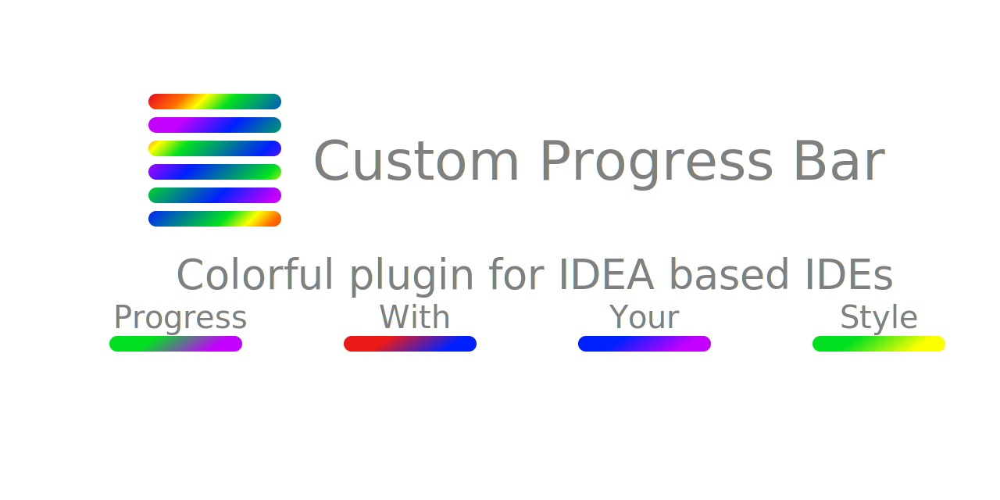

    

    
    
    

# Transform your IDE experience with the 'Custom Progress Bar' plugin for IDEA based IDEs. Pick your colors, make progress unique, and code with style!

## Changelog
- [Change log](https://github.com/Drewzillawood/intellij-custom-progress-bar/blob/main/CHANGELOG.md)

## Install it inside your IDE:
- For Windows & Linux - <kbd>File</kbd> | <kbd>Settings</kbd> | <kbd>Plugins</kbd> | <kbd>Marketplace</kbd> | <kbd>Search for "Custom Progress Bar"</kbd> | <kbd>Install Plugin</kbd> | <kbd>Restart IntelliJ IDEA</kbd>
- For Mac - <kbd>IntelliJ IDEA</kbd> | <kbd>Preferences</kbd> | <kbd>Plugins</kbd> | <kbd>Marketplace</kbd> | <kbd>Search for "Custom Progress Bar"</kbd> | <kbd>Install Plugin</kbd>  | <kbd>Restart IntelliJ IDEA</kbd>